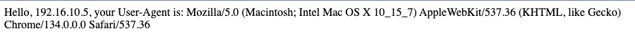

# DevOps en autonomie

## Getting started
L'application utilise python en version 3.13.2, elle peut fonctionner avec d'autre version également.

Pour garder un environnement de développement local propre j'utilise un virtualenv, pour l'utiliser depuis un linux/macos/wsl vous pouvez faire

```shell
source venv/bin/activate
python3 -m pip install -r requirements.txt
python3 src/app.py
```

L'application est très simple, elle renvoi en utilisant un serveur Flask un message Hello <votre_ip>, votre user-agent est : <user_agent> sur une requête GET



## Votre mission

### Dockerisation
Vous savez maintenant comment fonctionne notre application. Nous avons besoin de vous pour créer une image Docker de cette application.
Vu qu'on sera dans un container, inutile de prendre le dossier venv, mais penser a installer les requirements.

Créer un nouveau repository sur github dans lequel vous enverrez le code.

### CI
En utilisant Github créer un pipeline CI qui s'occupera de:
- Vérifier que le code est bien écrit avec [Flake8](https://flake8.pycqa.org/en/latest/), corrigez si nécessaire !
- Executez un test de securité sur le code dans `src/app.py` avec [Bandit](https://bandit.readthedocs.io/en/latest/), utilisez le paramètre `--severity-level` pour n'afficher que les problèmes en high
- Si et seulement si les deux tests précédents sont réussi alors lancer le docker build
- Lancer docker scout
- Envoyez l'image docker dans le registry public de docker

### Kubernetes
Réutilisez le code Terraform fournit lors de la dernière séance pour déployer un cluster Kubernetes dans Azure.
Pour rappel voici les commandes (Pensez a vous mettre dans le dossier ou il y a le code Terraform):
```shell
terraform init 
terraform apply
```
Vous pouvez aussi récupérer le code [ici](https://github.com/ynov-resources/devops-infra)

N'oubliez pas de récupérer la kubeconfig pour pouvoir vous connectez au cluster !

Une fois que c'est fait, installer les helm chart:
- [nginx-ingress](https://artifacthub.io/packages/helm/bitnami/nginx-ingress-controller)
- [kubecost](https://artifacthub.io/packages/helm/mesosphere-stable/kubecost)

### Helm
On est maintenant prêt pour déployer notre app sur le cluster Kube, on a besoin de vous pour créer le Helm Chart pour notre application.

Attention n'oubliez pas que l'application tourne sur le port `8080`, il faudra donc probablement modifier certains paramètres dans Helm.
Pensez à bien rattacher l'application sur l'Ingress Controller.

### CD
On y est on touche au but, créez un nouveau fichier pour la CD qui va s'occuper de déployer le Helm Chart que vous avez créé avec Helm install

## Le rendu
Dans moodle rendez-moi un fichier txt avec le lien vers votre repo Github.
Je dois retrouver:
- Les fichiers YAML pour la CI et la CD
- Le fichier de build Docker
- Le helm Chart que vous avez créé pour l'application
- Les lignes de commandes que vous avez tapez pour installer l'ingress controller et kubecost dans un fichier `helm.md`

**Si vous ne voulez pas mettre votre code en public sur Github pensez a m'ajouter dans les contributeurs [nomaddevops](https://github.com/nomaddevops)**